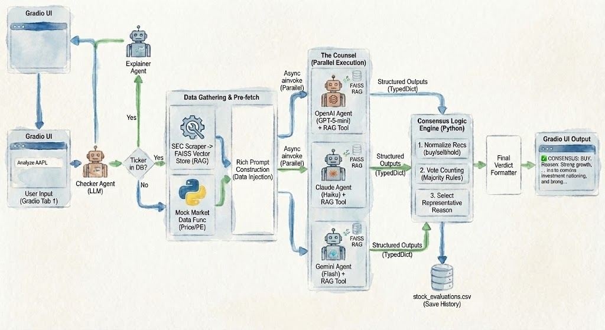
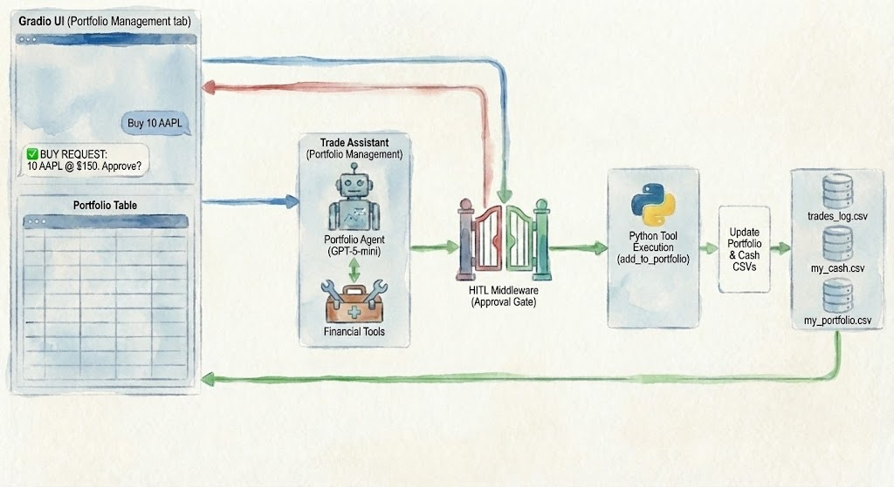
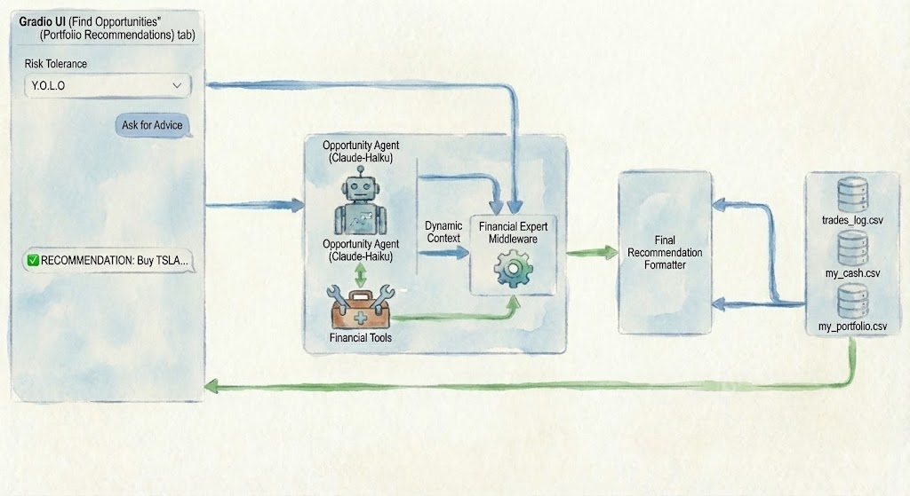

# 📈 AI-Powered Personal Investment Portfolio Manager

An advanced, multi-agent system for end-to-end personal investment management. This application leverages a "Counsel" of Large Language Models (LLMs) for deep equity research, a Human-in-the-Loop (HITL) agent for secure portfolio trading, and a dynamic persona-based agent for tailored investment opportunities.

Built with modern Python, **LangChain**, and **Gradio**.

---

## 🧠 Project Overview

This project demonstrates a sophisticated architecture of autonomous AI agents working in concert to solve complex financial tasks. It goes beyond simple chatbot interactions by implementing:

* **Multi-Agent Consensus:** Parallel execution of different LLMs (OpenAI, Claude, Gemini) to form a balanced research opinion.
* **Retrieval-Augmented Generation (RAG):** Ingesting and analyzing hundreds of pages of SEC 10-Q filings for grounded qualitative analysis.
* **Tool Use & Function Calling:** Agents autonomously use custom Python tools to read portfolios, check market data, and execute trades.
* **Human-in-the-Loop (HITL) Safety:** Critical actions like buying or selling assets require explicit user approval, bridging the gap between AI autonomy and human control.
* **Dynamic Prompting:** Agent personas and instructions adapt in real-time based on user UI selections (e.g., risk tolerance).

---

## ✨ Key Features & Architecture

The application is divided into three main functional tabs within a unified Gradio interface.

### 1. 🏛️ The Counsel of LLMs (Deep Research)

This tab provides comprehensive, multi-perspective research on any public company. You provide a ticker symbol, and the system orchestrates a parallel research process.

**Workflow:**
1.  **Pre-fetch Data:** A checker agent confirms the ticker. The system then scrapes recent SEC 10-Q filings, embeds them into a FAISS vector store, and fetches (mock) quantitative market data.
2.  **Parallel Analysis:** Three distinct agents (powered by OpenAI GPT-4o-mini, Claude Haiku, and Gemini Flash) are invoked simultaneously. Each uses the RAG tool to analyze the SEC filings and combines it with the market data to form an independent recommendation (Buy, Sell, or Hold).
3.  **Consensus Engine:** A deterministic Python logic block normalizes their recommendations, counts the votes to determine a majority consensus, and selects a representative reasoning to present to the user.



### 2. 💼 Trade Assistant (Portfolio Management)

This tab is your command center for managing your actual holdings and cash. It features a secure, agent-driven workflow for executing trades.

**Workflow:**
1.  **Natural Language Command:** You instruct the agent in plain English (e.g., "Buy 10 shares of Apple").
2.  **Agent Tool Selection:** The portfolio agent interprets the command and attempts to call the appropriate tool (e.g., `add_to_portfolio`).
3.  **HITL Middleware Gate:** Before the tool executes, a Human-in-the-Loop middleware intercepts the call. It pauses execution and presents a structured approval request in the UI, detailing the exact action, quantity, and price.
4.  **Execution & Update:** Only upon your explicit approval does the tool run, updating your persistent CSV databases (`my_portfolio.csv`, `trades_log.csv`, `my_cash.csv`) and refreshing the UI display.



### 3. 🎯 Find Opportunities (Tailored Recommendations)

This tab helps you find your next investment based on your personal financial profile and risk appetite.

**Workflow:**
1.  **User Preference:** You select your current risk tolerance from a dropdown menu in the UI (e.g., "Y.O.L.O" vs. "Let's take NO risks").
2.  **Dynamic Context Injection:** This selection is injected into the agent's context, dynamically altering its system prompt and persona to match your chosen investment style.
3.  **Context-Aware Analysis:** The agent uses its tools to read your current portfolio and cash balance. It combines this financial reality with its risk-adjusted persona to generate a highly tailored investment recommendation.



---

## 🛠️ Tech Stack

* **Language:** Python 3.10+
* **AI Framework:** [LangChain](https://python.langchain.com/) (using modern LangGraph patterns)
* **LLM Providers:** OpenAI (GPT-4o-mini), Anthropic (Claude Haiku), Google (Gemini Flash)
* **UI Framework:** [Gradio](https://www.gradio.app/)
* **Vector Store:** FAISS (Facebook AI Similarity Search)
* **Embeddings:** HuggingFace (`all-MiniLM-L6-v2`)
* **Data Source:** SEC EDGAR (via `edgar-python`)
* **Data Persistence:** Pandas & local CSV files
* **Package Manager:** `uv`

---

## 🚀 Getting Started

Follow these steps to set up and run the project locally.

### Prerequisites

* Python 3.10 or higher
* `uv` package manager (recommended) or `pip`
* API keys for OpenAI, Anthropic, and Google Gemini

### Installation

1.  **Clone the repository:**
    ```bash
    git clone [https://github.com/YOUR_USERNAME/YOUR_REPO_NAME.git](https://github.com/YOUR_USERNAME/YOUR_REPO_NAME.git)
    cd YOUR_REPO_NAME
    ```

2.  **Set up the environment:**
    If using `uv` (recommended):
    ```bash
    uv sync
    ```
    Alternatively, with `pip`:
    ```bash
    pip install -r requirements.txt
    ```

3.  **Configure API Keys:**
    Create a `.env` file in the root directory and add your API keys:
    ```env
    OPENAI_API_KEY=your_openai_key_here
    ANTHROPIC_API_KEY=your_anthropic_key_here
    GOOGLE_API_KEY=your_google_key_here
    # Add HuggingFace token if needed for specific models
    # HUGGINGFACEHUB_API_TOKEN=your_hf_token_here
    ```

### Usage

Run the main script to launch the Gradio application:

```bash
python main.py


Open your browser and navigate to the local URL provided in the terminal (typically http://127.0.0.1:7860). The CSV databases will be automatically initialized on the first run.

Disclaimer: This project is for educational and demonstration purposes only. The financial data and analysis provided by the AI agents should not be considered professional financial advice. Mock data is used for stock prices to avoid API costs.